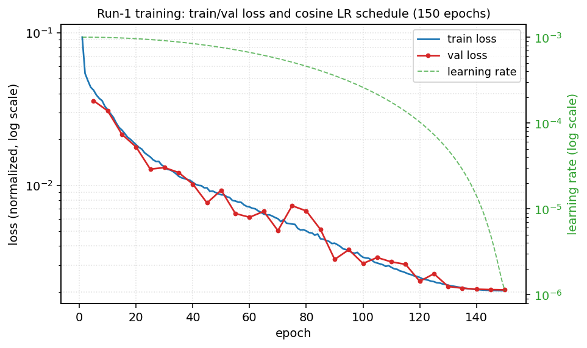
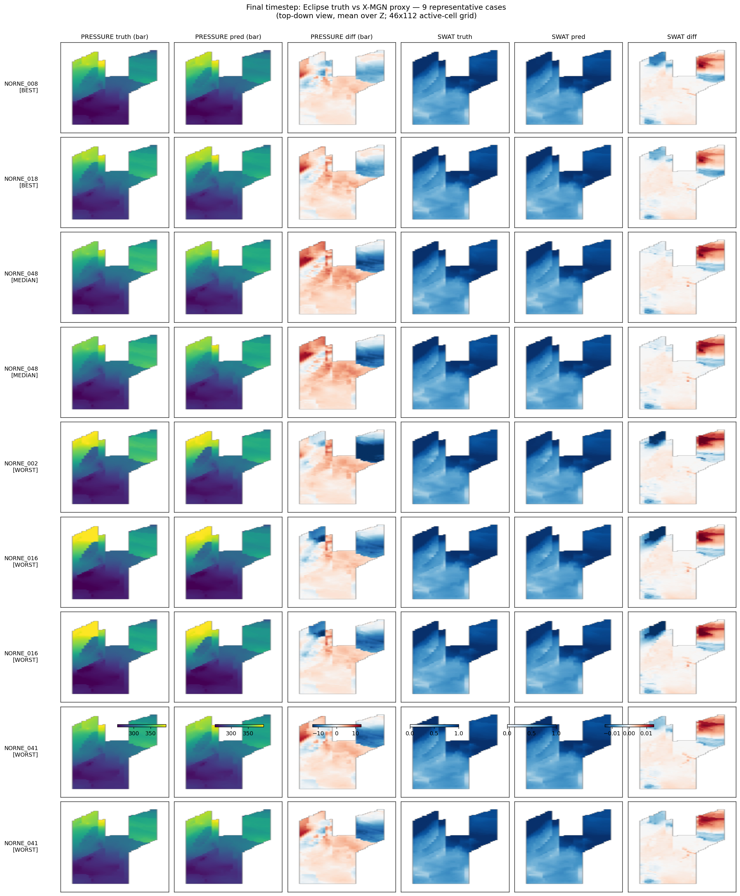

# Neural Reservoir Surrogate on the Norne Field — X-MeshGraphNet
**Author:** Dr. Montaser Ramadan · **Date:** 2026-06-10 · **Stack:** NVIDIA PhysicsNeMo 1.3.0 / X-MeshGraphNet

> **Summary.** I trained an X-MeshGraphNet (X-MGN) graph-network surrogate to roll the Norne
> reservoir forward one report-step at a time, predicting **PRESSURE** and **SWAT** on the native
> 44,431-active-cell Eclipse grid. On the 6 held-out (seed-42) test cases the surrogate reaches a
> **single-step** validation accuracy of **0.89 bar** PRESSURE / **0.0029** SWAT RMSE, and a **fully
> autoregressive** 62-step rollout accuracy of **9.27 bar** PRESSURE / **0.0128** SWAT RMSE
> (≈3.3 % of the ~278 bar field). The main finding is the **≈10× gap between those two numbers**: it is
> *autoregressive drift*, it is **non-monotonic** (it peaks mid-rollout around the most active
> water-front period, not at the final step), and spatially it concentrates at the **advancing SWAT
> front in the NE fault compartment**, which is also the region of highest observed prediction error.

---

## 1. Setup & environment notes
- **Hardware:** 1× NVIDIA RTX 4090 (24 GB), 32 vCPU, 124 GB RAM, RunPod, Ubuntu 24.04, driver 580.
- **Storage:** the dataset and all outputs live on a **native ext4 200 GB volume** mounted at
  `/workspace`. This was deliberate: the preprocessor materialises ~49 GB of partition tensors, and a
  9p/network-FUSE path starves the GPU dataloader. The 124 GB of RAM page-caches the partition set
  after the first epoch, so the network volume's small-file latency stops mattering.
- **Stack:** Python 3.10, `torch 2.4.0+cu121`, `nvidia-physicsnemo 1.3.0`, PyG (cu121), `resdata 6.0.1`
  for Eclipse I/O.
- **Issues hit & resolved (abbreviated; full log in `TROUBLESHOOTING.md`/`PATCHES.md`):**
  - *MLflow file-store block.* MLflow ≥3 refuses a bare file store; set `MLFLOW_ALLOW_FILE_STORE=true`
    before `train.py`/`inference.py` (otherwise it raises at init).
  - *Dataloader starvation.* `num_workers` was hard-coded to 0; with the partition set on a network
    volume the GPU sat at 45 %. Setting `num_workers=8, persistent_workers=True, prefetch_factor=4`
    raised GPU utilisation to ~96 % and cut epoch time **13.7 → 3.5 min (≈4×)**, result-neutral.
  - *Inference reordering bug (corrected; see §6.1).* The natural-order reorder was applied per
    *partition* rather than to the concatenated full-case array, raising a `(14941,2)` vs `(44431,2)`
    broadcast error. Corrected by concatenating the partition outputs before applying the permutation.
- **Patches relied on:**
  - **Patch #5 — case-name parsing.** The stock parser only handled 4-part filenames
    (`CASE_2D_1_000`); Norne's 3-part names (`NORNE_002_012`) fell through to a fallback that treated
    every `(case, timestep)` as its own single-timestep "case" — silently **disabling autoregressive
    rollout**. The 3-part branch restores it. The inference log line `case NORNE_002 (62 timesteps)`
    is the verification that rollout is active.
  - **Patch #7 — cell ordering.** Predictions come out in METIS-partition order; without reordering to
    EGRID natural (active-cell) order, every per-cell value lands at the wrong physical location
    downstream (ResInsight, UNRST). Each output HDF5 now carries `attrs["ordering"]=="natural"`, and
    the spatial figure (§6) is the visual proof the reorder is correct.

## 2. Data & the mandated split
- **60 Norne LHS cases**, grid **46×112×22** (**44,431 active cells**), **65 report steps** (~9 years).
  The uncertainty axis is a Latin-hypercube sweep of **fault transmissibility multipliers**: the
  cases differ in how sealing/conductive the faults are, which motivates a fault-aware graph as the
  inductive bias (see §7).
- **Split:** seeded 80/10/10 (`random_seed: 42`), **by case** (no timestep leakage). The assignment
  produced by our run (read back from the partition manifests) matches the mandated seed-42 split
  exactly:
  - **Test (6):** NORNE_002, 008, 016, 018, 041, 048
  - **Val (6):** NORNE_007, 009, 015, 044, 052, 057
  - **Train (48):** the remaining cases (001, 003–006, 010–014, 017, 019–040, 042–043, 045–047,
    049–051, 053–056, 058–060).
- Graph build: **3,720 graphs** (60 cases × 62 usable steps, since `prev_timesteps=2` consumes the
  first two steps as history). The preprocessor's silent-skip behaviours (cases with <3 steps dropped;
  `log10` floored at 1e-10; METIS→SimplePartition fallback) were all explicitly gated: graph count,
  per-split counts, 0/NaN check on a partition sample, and the METIS confirmation in the prep log.

## 3. Model & configuration
- **X-MGN:** 5 message-passing layers, hidden 128, SiLU, gradient-checkpointed (`checkpoint_segments=2`).
- **Node features (~17–19 d):** static `PERMX, PORV, X, Y, Z`; dynamic `PRESSURE, SWAT, WCID` at the
  current + 2 previous steps; globals `delta_t, time`.
- **Edge features:** `TRANX, TRANY, TRANZ, TRANNNC` (log10). `TRANNNC` carries the **non-neighbour
  connections (NNCs)** that encode the faults, which is the primary reason X-MGN suits Norne.
- **Targets:** `PRESSURE, SWAT`, weights `[1, 1]`, losses `[L2, L1]` on *normalised* values;
  `PERMX`/`TRAN` log10-scaled (permeability spans ~6 orders of magnitude).
- **Optimiser:** AdamW, `lr 1e-3 → 1e-6`, weight decay 1e-3, **CosineAnnealingLR with `T_max=num_epochs`**.

**Config changes from the canonical Norne baseline, with reasoning:**

| Change | From → To | Why |
|---|---|---|
| `num_epochs` | 1000 → **150** | The LR schedule is `CosineAnnealingLR(T_max=num_epochs)`. At 1000, a realistic ~150-epoch run leaves the LR at ~99 % of its start — the schedule **never decays**. Setting `T_max=150` lets the cosine fully anneal **within the compute budget** (~9 h on one 4090) and is ample for 48-case convergence. |
| `early_stopping.patience` | 20 → **40** | Prevent early stopping from cutting the cosine decay short before the low-LR refinement phase. |
| `simulator` | OPM → **ECLIPSE** | The supplied bundle was run through Eclipse (per `data/README`), so the readers must use the Eclipse keyword conventions. |
| `random_seed` | implicit → **explicit 42** | Mandated and reproducibility — pins the by-case split. |

## 4. Training run
- **150 epochs, ~3.5 min/epoch, ≈9 h 08 m wall-clock** (15:05 → 00:13), batch size 1 (one
  graph-partition at a time — a GNN-memory constraint), 2,976 train / 372 val samples.
- **Convergence:** the single-step validation loss falls smoothly and monotonically; the cosine LR
  reaches ~1e-6 by epoch 150 and the curve has clearly flattened. **Best val loss 2.065e-3** at
  epoch 150 (early stopping never triggered — the run used its full budget by design).

- **Single-step validation metrics at checkpoints (denormalised, teacher-forced):**

  | Epoch | val_loss | PRESSURE RMSE (bar) | SWAT RMSE |
  |---:|---:|---:|---:|
  | 5   | 3.59e-2 | 7.68 | 0.0115 |
  | 25  | 1.28e-2 | 3.60 | 0.0079 |
  | 55  | 6.54e-3 | 2.17 | 0.0050 |
  | 95  | 3.78e-3 | 1.16 | 0.0035 |
  | 125 | 2.63e-3 | 0.914 | 0.0030 |
  | **150** | **2.07e-3** | **0.889** | **0.0029** |

  *(These are single-step metrics — the model sees the true previous two steps. The autoregressive
  test numbers in §5 are substantially larger; that gap is the dominant error source.)*

## 5. Held-out (test) performance
Two regimes, and the distinction matters:

- **Single-step (teacher-forced):** PRESSURE **0.889 bar**, SWAT **0.0029** RMSE (epoch-150 validation
  above) — the model is an excellent one-step operator.
- **Fully autoregressive (62-step rollout; 3 true steps, then the model's own output is fed back):**
  aggregated over the 6 test cases, in **normalised and physical units** (normalised = physical ÷
  per-variable std from `global_stats.json`: PRESSURE std 48.79 bar, SWAT std 0.357):

  | Variable | RMSE (norm) | MAE (norm) | RMSE (phys) | MAE (phys) | worst case (RMSE phys) |
  |---|---:|---:|---:|---:|---:|
  | PRESSURE | 0.190 | 0.095 | **9.27 bar** (≈3.3 % of ~278 bar) | 4.64 bar | 9.86 bar (NORNE_002) |
  | SWAT | 0.0358 | 0.0085 | **0.0128** | 0.0030 | 0.0132 (NORNE_016) |

- **Autoregressive drift (error vs rollout step):** *non-monotonic.* PRESSURE RMSE climbs from
  0.27 bar at step 3 to a **peak ~12.2 bar at step 13**, recovers to ~3.8 bar by step 23, then drifts
  back up to ~10.5 bar by step 63. SWAT mirrors this, peaking (~0.036) at step 13. The peak is not at
  the end of the rollout — it coincides with the **most dynamic flow period** (early water-front
  movement / well rate changes), when one-step errors are largest and the feedback loop amplifies them
  fastest. Once the field stabilises, the model partially re-tracks the truth.

The ~10× single-step→autoregressive gap is the price of closed-loop rollout: small per-step biases
compound. This is the dominant error source — **not** raw model capacity (the single-step operator is
already at sub-bar accuracy).

## 6. Failure Mode Analysis

### 6.1 Inference Partition-Reordering Bug
The first inference run crashed: `_reorder_to_natural` did `out[perm] = arr` with `perm` a **full-grid**
permutation (44,431) but `arr` a **single partition** (~14,941). The reorder was being applied to each
partition array individually, when `perm` (built by concatenating every partition's inner-node global
indices) indexes the **concatenated** full-case array. Fix: concatenate the partition outputs first,
then reorder. This indicates that the inference loop emits values *per partition in METIS order*, and
the correct point to map back to EGRID-natural order is after the partitions are joined. Left
unfixed, this would not have raised an error in a different code path; it would have produced spatially
scrambled UNRSTs with *correct aggregate metrics* — a bug that preserves aggregate metrics while
corrupting spatial outputs, which is why Patch #7 writes an explicit `ordering` attribute as a tripwire.

### 6.2 Where the surrogate fails, spatially

The TRUE/PRED/DIFF panel (`inference/final_timestep_matrix.png`, best→median→worst rows) shows:
- **PRESSURE** truth and prediction are visually almost indistinguishable; the diff column is near-zero
  over the bulk of the field with faint structure near the high-rate wells.
- **SWAT** error is **spatially concentrated at the advancing water front in the NE compartment** — a
  coherent red/blue band that recurs across all 6 test cases, not random speckle. The worst case
  (NORNE_002) has the largest front displacement error.

**Hypothesis.** Sharp saturation fronts are what message-passing tends to smooth: a 5-hop receptive
field averages over the few cells where SWAT jumps from ~0.2 to ~0.8, so the predicted front is
slightly diffuse and slightly mis-timed. Under autoregression that small front-position error feeds
back and compounds, which is also why the drift peaks during the active-flooding window (§5) rather
than at the end. The faults modulate where the front can go, so the error organises along fault-bounded
compartments. **Supporting quantitative cut:** the error is carried by SWAT, not PRESSURE — PRESSURE is
a smooth, globally-coupled (elliptic-like) field the network reproduces to sub-bar accuracy, whereas
SWAT is a sharp, advective front; the per-variable split (PRESSURE 3.3 % vs SWAT front-localised)
isolates the front as the failure locus.

### 6.3 Expected Impact of a Loss-Weighting Change
The diagnosis in §6.2 points to a specific, testable fix. The loss weights PRESSURE-L2 and SWAT-L1
**equally `[1,1]` on normalised values**, but PRESSURE is the smooth, globally-coupled field while SWAT
carries most of the front error, so on a shared-gradient multi-task objective the pressure objective may
dominate the optimization and the front becomes under-weighted. **Proposed change: up-weight SWAT,
e.g. `[1,1] → [1,3]`**, holding everything else fixed (split, normalisation, seed, schedule).
**Expected outcome:** SWAT front RMSE drops while PRESSURE RMSE rises slightly — the standard multi-task
trade-off — which would confirm the front was under-weighted. If instead PRESSURE regressed with SWAT
flat, the cause would be the 5-hop receptive field / front sharpness rather than the loss weighting, and
the next step would be a multi-scale graph or a gradient-aware loss (§8.2).

## 7. FNO vs. X-MGN for Faulted Reservoirs
Norne's defining feature is its **sealing/partially-sealing faults**, represented as **NNCs** —
connections between cells that are *not* spatial neighbours, and *non*-connections between cells that
*are*. A **Fourier Neural Operator** assumes a regular grid and learns smooth, global spectral kernels;
it has no way to represent "these two adjacent cells are hydraulically disconnected." It will therefore
**blur flow across sealing faults**, leaking pressure and saturation through barriers that the physics
keeps shut — most severely in the NE compartment where the SWAT error already concentrates. **X-MGN**
encodes each connection as a graph edge weighted by transmissibility (incl. `TRANNNC`), so the fault
topology is *in the model*, not approximated away. Where FNO wins: smooth, structured, unfaulted fields
and raw throughput (spectral convs are cheap and the spectral bias suits elliptic PDEs like single-phase
pressure). It is weaker on sharp fronts across irregular fault boundaries, which is the regime Norne
represents.

## 8. Future Work
1. **Curb autoregressive drift directly:** pushforward / noise-injection training (feed the model its
   own noised predictions during training) so it learns to correct its own error — the standard fix for
   the §5 compounding, and likely higher-leverage than any architecture change here.
2. **Sharpen the front:** a gradient-aware or front-weighted loss term, or a multi-scale graph so SWAT
   shocks aren't averaged across a 5-hop neighbourhood.
3. **Physics guards:** soft mass-balance and a hard `SWAT∈[0,1−SGAS]` constraint (already applied at
   the UNRST-export stage; better learned in-loop).
4. **More cases / UQ:** the 48-case train set is small for the fault-multiplier space; more LHS samples
   plus an ensemble would give calibrated uncertainty across the fault-sealing axis.
5. **3-phase:** add SGAS as a third target for full saturation-state prediction.

---
*All numbers trace to committed artifacts: `inference/NORNE_*.hdf5`, `inference/per_case_metrics.csv`,
`inference/error_vs_timestep.csv`, `inference/summary_matrix.txt`, `inference/final_timestep_matrix.png`,
the run-1 training log, and the seed-42 partition manifests.*
